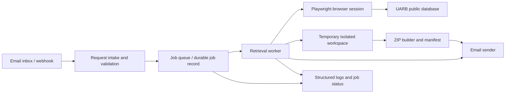

# Regulatory filing retrieval agent — design

**Status:** Proposed implementation design  
**Source:** *Senpilot’s Technical Assignment*, Winter 2027, pages 2–4  
**Target:** A working agent that accepts an email request, retrieves public documents from the Nova Scotia UARB Public Documents Database, and replies with a ZIP attachment.

## 1. Objective and scope

An incoming email specifies one matter number and one document type. The agent opens the [UARB database](https://uarb.novascotia.ca/fmi/webd/UARB15), finds the matter, records matter metadata and the total number of documents in each of the five requested categories, downloads up to ten files from the chosen category using **Go Get It**, compresses the successful downloads, and replies to the sender with the ZIP and a factual summary.

The supported types are **Exhibits**, **Key Documents**, **Other Documents**, **Transcripts**, and **Recordings**. The site screenshot also shows **Hearings** and **Related Matters** tabs; these are outside the assignment's requested categories and are excluded from document counts. Matter numbers follow `M` plus five digits, such as `M12205`.

The Board's current database guide labels the recordings tab **Audio Files** and says a tab with a displayed count of zero does not open. Map an email request for Recordings to Audio Files when that is the live tab label. The guide also says **Go Get It** opens a filename confirmation button before the browser download starts; verify this behavior against the live page.

The first version processes one matter and one category per email. It should not infer missing values, claim a download succeeded before checking the file, or report a count from only the first page of a paginated tab.

## 2. Required behavior and acceptance criteria

| ID | Requirement | Acceptance check |
| --- | --- | --- |
| R1 | Read an incoming email and extract exactly one matter number and one supported document type. | The example request for `M12205` and `Other Documents` is parsed; ambiguous requests get a clarification reply. |
| R2 | Search using the site's **Go Directly to Matter** field. | The opened detail page displays the requested matter number before any downloads. |
| R3 | Count all files in each of the five supported categories. | Counts reflect complete tab results, including pagination or a site's authoritative total. |
| R4 | Download at most ten files from the requested tab through **Go Get It**. | ZIP contains zero to ten verified files, all from the requested matter and category. |
| R5 | Include a ZIP in the reply. | The sent message has a valid `.zip` attachment that can be opened. |
| R6 | Summarize matter metadata and counts. | Reply identifies matter, title, available type/category, initial and final filing dates if shown, five category counts, and downloaded/requested totals. |
| R7 | Handle errors without misleading output. | Missing matter, empty category, failed downloads, and attachment limits produce explicit, accurate outcomes. |

**Interpretation of “total count of all files”:** Report the grand total across the five requested categories *and* the five per-category counts. If the site’s “Found Count” differs from a tab header count, use the verified full result count and flag the discrepancy in logs. The counts are document records displayed by the site; they need not equal the number of unique underlying binary files if the site contains duplicates.

## 3. Proposed architecture



**Suggested stack:** Python 3.12+, Playwright, an email provider's inbound webhook and outbound API, standard-library `email`/`zipfile`, and SQLite for a small single-worker deployment. A provider adapter keeps mail-specific code separate from retrieval. Browser automation is the primary site integration because the supplied UI uses dynamic tabs and button-triggered downloads; the live URL currently serves a JavaScript-dependent app. Avoid depending on undocumented internal FileMaker endpoints.

The language model is optional and limited to interpreting varied email prose or polishing the response. Regex and a fixed category vocabulary validate the final request. Matter metadata, document counts, filenames, and dates come only from the site, not from generated text.

### Components

- **Mail adapter:** verifies the inbound webhook or polls a dedicated inbox; reads sender, subject, body, and provider message ID; sends MIME replies with attachments.
- **Parser:** normalizes whitespace and case; extracts `\bM\d{5}\b`; matches the five exact document categories and conservative singular aliases. It rejects multiple distinct matter numbers or categories.
- **Job coordinator:** deduplicates by inbound message ID, tracks state and attempt count, enforces one active browser job per worker, and retries transient failures.
- **UARB browser client:** performs site navigation, confirms matter identity, extracts header metadata and tab counts, enumerates the requested category, and triggers downloads.
- **Archive builder:** validates the downloaded files, creates safe deterministic names, writes `manifest.json`, and tests ZIP integrity.
- **Reply composer:** uses a factual template and includes attachment plus concise partial-failure notes when applicable.

## 4. End-to-end flow

1. **Receive and deduplicate.** Accept the inbound email only once for each provider message ID. Store its sender and message ID, then enqueue a job. A retry must not send duplicate responses.
2. **Parse.** Search subject and plain-text body. Strip quoted prior messages and signatures where practical. Normalize the matter to uppercase and map category spelling to the fixed list. If missing or ambiguous, send a short clarification without browsing.
3. **Open the site.** Start a fresh Playwright browser context with a per-job download directory. Navigate to the published UARB URL, wait for the **Go Directly to Matter** input, enter the matter, and click its Search button. Use semantic locators and explicit readiness checks rather than fixed sleeps.
4. **Confirm the matter.** Read the matter number shown in the result header and require an exact match. Capture title/description, matter type, category, initial filing date, final filing date, and other clearly labeled fields if available. Preserve raw strings and normalize dates separately. Never interpret blank final dates as an actual final filing.
5. **Count all five tabs.** Read each tab's displayed count, then verify against the tab's “Found Count” or complete row enumeration. Account for paging, lazy loading, and filters. Clear any carried-over filter before counting. Record both displayed and verified counts where they differ. If a total cannot be established, mark it unavailable rather than reporting a partial number.
6. **Select the requested files.** Open the requested tab and enumerate rows in default site order. For each candidate, capture document ID, title, extension, date, and a stable row locator. Take the first ten eligible records. The order is a deliberate, deterministic choice; no ranking is implied by the assignment. Record the total eligible count before limiting to ten.
7. **Download.** For each selected record, click **Go Get It** inside Playwright's download expectation, save into the job directory, and verify that a nonempty file exists. If the button opens a new tab or generates a URL instead of a download event, handle that observed behavior in the browser adapter while keeping the same row-level validation. Do not reuse a stale session across jobs.
8. **Package.** Create `M12205_Other_Documents.zip` style names. Add only validated files and a `manifest.json` containing matter, category, source record metadata, source URL or record ID, original filename, archive filename, byte size, SHA-256, and retrieval timestamp. Resolve duplicate and unsafe filenames using a document ID or ordinal; prevent path traversal. Validate the ZIP by reopening it and testing CRCs.
9. **Reply.** Include matter metadata, counts for all five categories and grand total, requested category total, number successfully downloaded, and any failures. Attach the ZIP, reply to the original message, and persist the outbound provider ID. If no documents exist, send a truthful no-results reply and omit an empty ZIP unless the evaluation explicitly requires one.
10. **Clean up.** Remove the temporary job files after successful send and retention window; retain structured metadata, error codes, and hashes for diagnostics.

## 5. Data contract

```text
Request
  inbound_message_id: string
  sender_email: string
  matter_number: string          # ^M[0-9]{5}$
  requested_type: enum           # five supported categories

MatterSnapshot
  matter_number: string
  title: string | null
  matter_type: string | null
  category: string | null
  initial_filing_date: date | null
  final_filing_date: date | null
  captured_at: timestamp
  source_url: string
  counts: map<document_type, integer | null>
  count_method: map<document_type, header | found_count | paged_rows>

DocumentRecord
  site_document_id: string | null
  title: string | null
  date: date | null
  extension: string | null
  original_filename: string | null
  archive_filename: string | null
  sha256: string | null
  bytes: integer | null
  status: selected | downloaded | failed
  error_code: string | null

Job
  state: received | needs_clarification | searching | counting |
         downloading | packaging | sending | completed | failed
  attempt: integer
  error_code: string | null
  outbound_message_id: string | null
```

SQLite needs a unique key on `inbound_message_id` and a unique outbound-send marker per job. The in-memory objects can use typed dataclasses or Pydantic models. Do not persist full email bodies or downloaded documents beyond the retention period unless debugging requires it and access is restricted.

## 6. Browser implementation details

The screenshots show a **Go Directly to Matter** search box, a matter header, tabs with counts, a “Found Count” area, and a **Go Get It** action on document rows. These labels are useful locator anchors, but the live DOM and download mechanics must be verified during implementation. Keep all selectors in one adapter module and test them against at least two matters and multiple categories.

- Use accessible roles and text where unique, then scope locators to the search panel, selected tab, or document row. Avoid coordinate clicks and brittle absolute CSS paths.
- Wait for the requested matter ID and selected tab to become visible after each transition. A displayed match is required before reading rows.
- For counts, prefer a visible authoritative total if it reliably represents the full category. Otherwise paginate to completion, tracking stable document IDs to avoid double-counting.
- Reset site filters and page position before selecting the first ten. This ensures counts and selection use the same unfiltered category.
- A download timeout, HTML error page saved as a file, zero-byte file, or unexpected extension is a failed document. Retain the row metadata and continue where safe.
- Limit parallel downloads to one browser interaction at a time because this site may use session state. A worker may process separate jobs concurrently only after testing session isolation and site tolerance.
- Bound navigation, count, and per-file download durations. Retry transient navigation failures with a fresh context; never retry an outbound email without checking whether the previous send succeeded.

## 7. Email response contract

**Success template**

> Subject: Documents for M12205 — Other Documents  
> M12205: [matter title]. Type: [matter type]; category: [category]. Initial filing: [date or “not listed”]. Final filing: [date or “not listed”].  
> The database lists [E] Exhibits, [K] Key Documents, [O] Other Documents, [T] Transcripts, and [R] Recordings ([sum] documents across these five categories).  
> I downloaded [N] of [requested category count] Other Documents and attached them in a ZIP. [If applicable: X selected downloads failed; see manifest or reply note.]

The exact example metadata in the assignment is illustrative; live values must be read from the requested matter. A partial result must say “downloaded N of X” and list failed document IDs or titles, rather than imply all ten were attached. If any count is unavailable, say so and avoid a grand total that would be incomplete.

Before sending, check the provider's attachment size limit. If the ZIP is too large, do not silently omit the attachment or switch to a link. Mark the job as unable to fulfill the attachment requirement and send a clear failure response identifying the size constraint; a production extension could use a suitable mail provider or split archives only if the requirements change.

## 8. Failure handling and safeguards

| Condition | Behavior |
| --- | --- |
| No or multiple matter numbers/types | Ask for one valid matter number and one of the five supported types. |
| Matter absent or page ID mismatch | Stop before downloads; reply that the matter could not be located. |
| Count unavailable | Report the affected count as unavailable; continue only if requested-tab rows can be verified. |
| Requested tab has zero documents | Report zero and no ZIP; no false download claim. |
| Some downloads fail | Package successful files, report successes and failures, include manifest. |
| All selected downloads fail | Do not send an empty ZIP; reply with a failure summary. |
| ZIP too large or send rejected | Preserve job state for retry/operator review; do not mark complete. |
| Site login, captcha, or access restriction appears | Stop and surface the blocker; do not attempt to bypass access controls. |

Use a dedicated mailbox. Validate inbound webhook signatures, escape all untrusted text in logs and email rendering, sanitize filenames, cap individual and total download size, enforce timeouts, and avoid executing downloaded content. Public document access still warrants rate limiting and respectful retry backoff. Record only the minimum sender data needed to reply.

## 9. Verification plan

### Automated tests

- Parser cases: the assignment's example; casing and punctuation variations; missing type; two matters; two types; `M` followed by the wrong digit count; quoted replies containing an old matter.
- Counting cases: empty tab, header count, paginated rows, duplicate row IDs, mismatched header/row count, and a filter accidentally left active.
- Download cases: normal file, duplicate filename, zero-byte file, HTML error response, timeout, and partial success.
- Archive cases: at most ten document files, safe names, manifest/hash consistency, valid ZIP CRC, and correct attachment MIME type.
- Idempotency cases: duplicate webhook delivery and retry after an uncertain email-send response.

### Live acceptance run

1. Send the provided `M12205` / `Other Documents` request to the dedicated inbox.
2. Compare matter header metadata and five counts against the site at run time; do not hardcode the PDF example counts.
3. Confirm no more than ten requested-category documents appear in the ZIP, each opens, and the manifest matches the contents.
4. Confirm the email reaches the sender with the ZIP attached and a correct grand total and per-category summary.
5. Repeat with a category containing fewer than ten documents and with an invalid matter request.

Store a redacted run log and screenshots at important browser steps to diagnose site changes. Avoid asserting exact live counts in a long-lived test because filings can change.

## 10. Delivery sequence

1. **Browser proof of concept:** manually inspect the current DOM and download behavior, then automate search, matter confirmation, all five counts, and one download.
2. **Core retrieval:** implement pagination, ten-file cap, validation, archive, and manifest; verify against multiple matters.
3. **Email integration:** implement inbound parsing, queue/idempotency, template, attachment sending, and size handling.
4. **Hardening:** retries, structured logs, limits, failure replies, and live acceptance tests.

## 11. Assumptions and open decisions

- **Email provider:** The assignment names no provider. Select one with inbound webhooks and attachment-capable outbound API during implementation; the adapter keeps that choice replaceable.
- **File selection order:** Choose the first ten in the site's default order. If the evaluator expects another policy, define it explicitly before coding.
- **“All files” total:** The design totals the five named document types. The screenshot's Hearings and Related Matters tabs are excluded because they are not listed as supported document types.
- **Partial delivery:** Sending verified successes with an explicit failure note is preferable to failing the entire job, unless zero files were retrieved.
- **Live site behavior:** DOM structure, pagination, authentication, and download responses remain to be confirmed through a browser proof of concept. The design does not assume the screenshot is a stable API contract.

## References

- *Senpilot’s Technical Assignment — Winter 2027*, supplied PDF, pages 2–4 (requirements and UI screenshots).
- [Nova Scotia UARB Public Documents Database](https://uarb.novascotia.ca/fmi/webd/UARB15) (live entry point; JavaScript application).
- [Nova Scotia Energy Board: How to Use the Database](https://nserbt.ca/nseb/matters-evidence/how-use-database) (tab counts, Audio Files label, and filename confirmation step).
